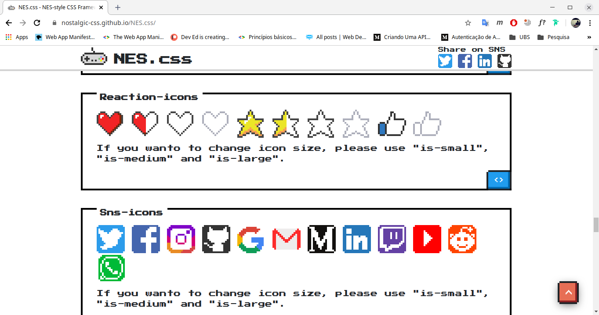
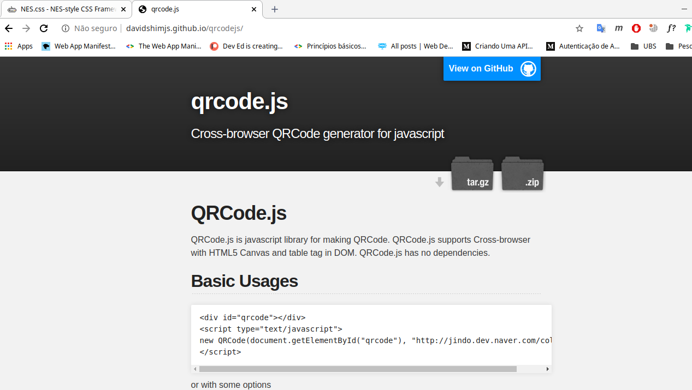
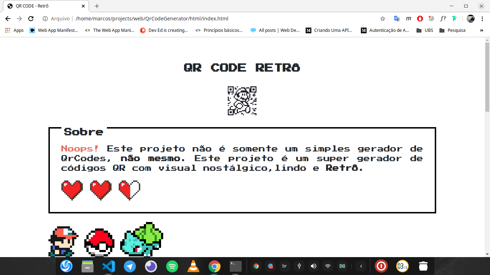
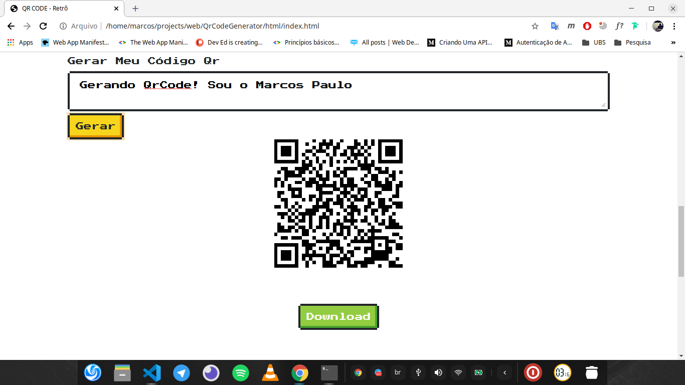
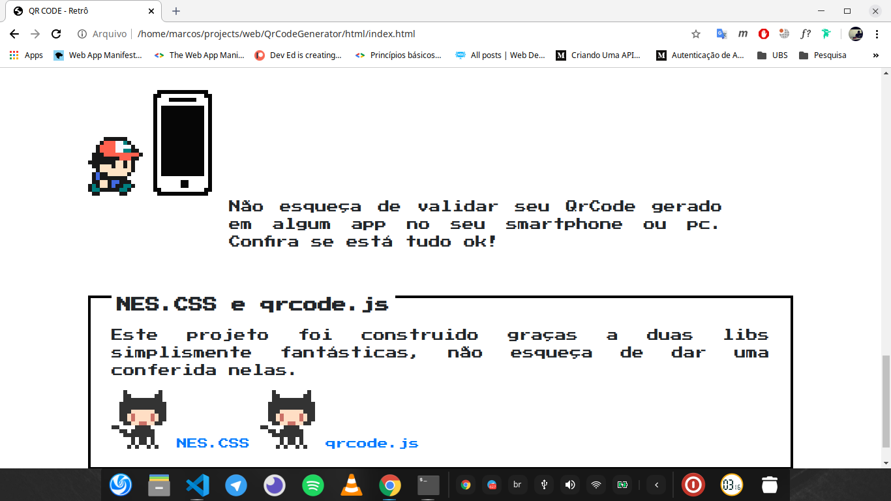

# Gerador de Código QR
## Simples projeto em HTML5,CSS3 e JS para a geração de QrCodes. A estilização da página segue o conceito nostálgico e retrô.

# NES.CSS 
## A estilização foi feita utilizando o framework css [NES.CSS](https://github.com/nostalgic-css/NES.css), o NES.CSS fornece uma série de classes css com uma estilização nostágica e retrô.

# qrdcode.js
## A lib [qrdcode.js](https://github.com/davidshimjs/qrcodejs) fornece toda a estrutura necessária para a geração de códigos qr, a mesma é de fácil e simples utilização.

# Resultado Final
## Utilizando o NES.CSS e o qrcode.js foi possível construir uma página web bem simples e totalmente funcional. as funcionalidades desenvolvias foram:
1. Geração de um novo código a partir de uma entrada do usuário;
2. Download do código gerado.

# Screenshots

